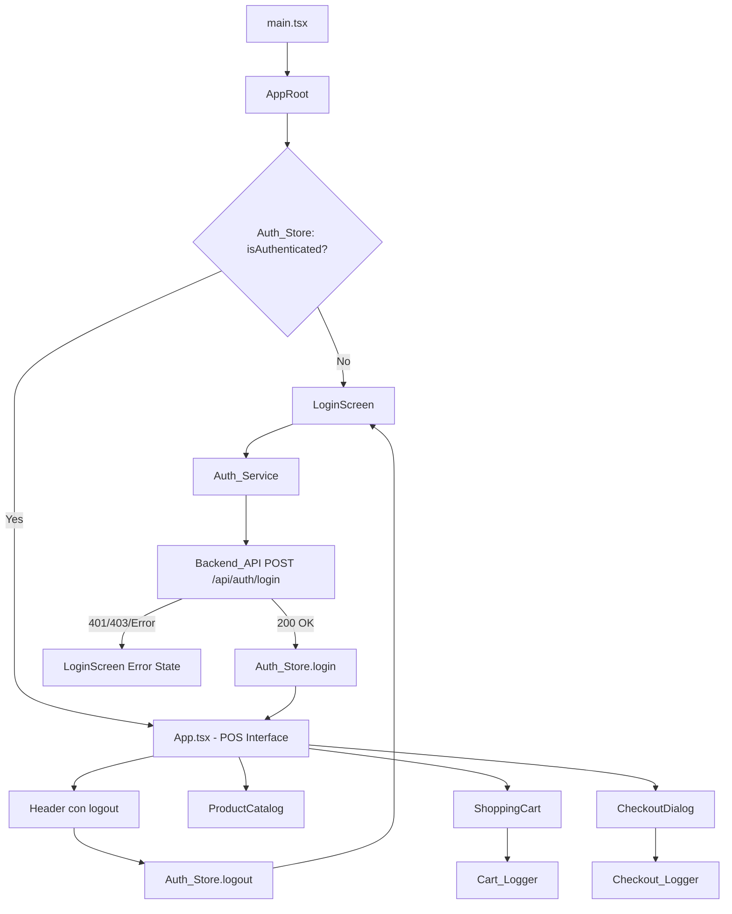
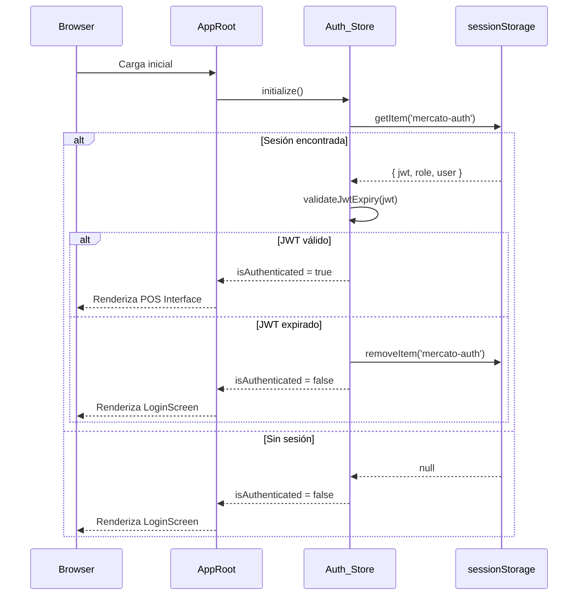
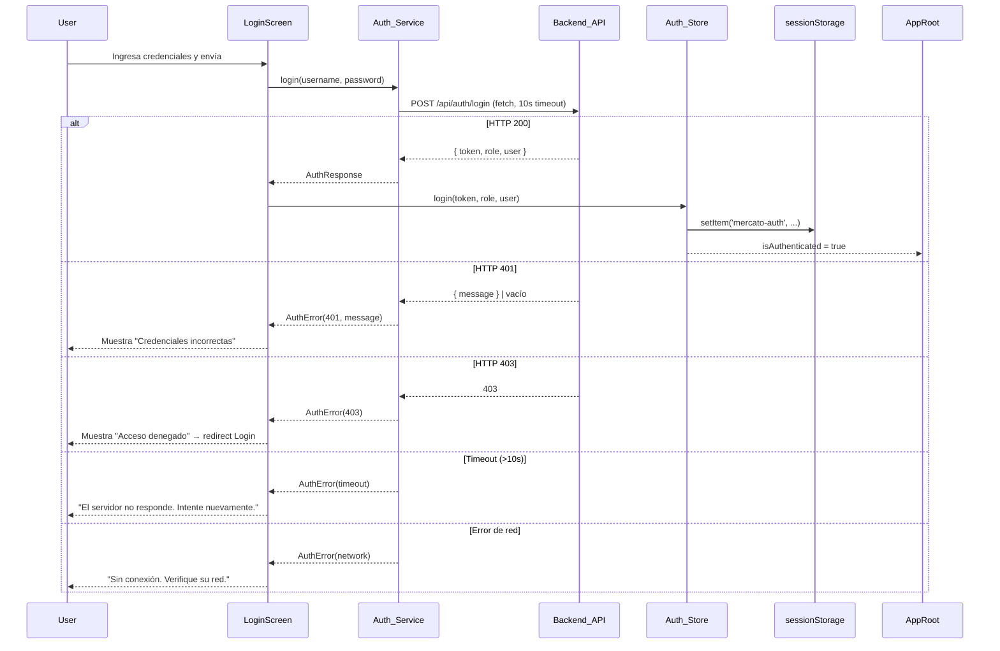

# Design Document — POS Login & Auth

## Overview

Este documento describe el diseño técnico para agregar autenticación basada en roles al sistema POS MERCATO. La funcionalidad introduce una pantalla de login, un store de autenticación (Zustand), un servicio HTTP de autenticación, protección de rutas, y módulos de trazabilidad (logging) para las operaciones de carrito y checkout.

El sistema actual opera sin autenticación: `App.tsx` renderiza directamente la interfaz POS. El diseño propuesto envuelve `App` en un componente de guardia que decide si mostrar el `LoginScreen` o la interfaz principal según el estado de la sesión en `Auth_Store`.

### Principios de diseño

- **Sin dependencias nuevas de routing**: El proyecto no usa React Router. La navegación entre Login y POS se implementa con renderizado condicional en el componente raíz.
- **Consistencia visual**: El `LoginScreen` usa exclusivamente las variables CSS del sistema (`--pos-accent`, `--pos-bg-primary`, etc.) y los componentes PrimeReact ya instalados.
- **Separación de responsabilidades**: Auth_Service (HTTP), Auth_Store (estado), Cart_Logger y Checkout_Logger son módulos independientes.
- **Seguridad mínima viable**: JWT en `sessionStorage` únicamente; la contraseña no persiste tras el login.

---

## Architecture



### Flujo de inicialización



### Flujo de login



---

## Components and Interfaces

### Nuevos archivos a crear

```
src/
├── auth/
│   ├── authService.ts          # Auth_Service: llamadas HTTP
│   ├── authStore.ts            # Auth_Store: estado Zustand
│   └── jwtUtils.ts             # Utilidades JWT (decode, expiry check)
├── components/
│   ├── auth/
│   │   └── LoginScreen.tsx     # Pantalla de login
│   └── layout/
│       └── Header.tsx          # MODIFICAR: agregar logout + admin badge
├── loggers/
│   ├── cartLogger.ts           # Cart_Logger
│   └── checkoutLogger.ts       # Checkout_Logger
└── AppRoot.tsx                 # Nuevo componente raíz con guardia de auth
```

### Archivos a modificar

| Archivo | Cambio |
|---|---|
| `src/App.tsx` | Sin cambios estructurales; `AppRoot` lo envuelve |
| `src/main.tsx` | Renderiza `AppRoot` en lugar de `App` |
| `src/components/layout/Header.tsx` | Agrega control de logout y badge de admin |
| `src/store/posStore.ts` | `processPayment` usa `cashier` del `Auth_Store`; `addToCart` llama a `Cart_Logger` |
| `src/components/checkout/CheckoutDialog.tsx` | Llama a `Checkout_Logger` en inicio y fin de pago |

---

### `Auth_Store` — Interface

```typescript
// src/auth/authStore.ts

export type UserRole = 'ADMIN' | 'CASHIER'

export interface AuthUser {
  id: string
  username: string
  displayName: string
}

export interface AuthSession {
  jwt: string
  role: UserRole
  user: AuthUser
}

interface AuthState {
  session: AuthSession | null
  isAuthenticated: boolean
  isInitialized: boolean

  // Actions
  initialize: () => void
  login: (session: AuthSession) => void
  logout: () => void
}
```

**Decisión de diseño**: Se usa un único objeto `session` en lugar de campos separados (`jwt`, `role`, `user`) para simplificar la serialización en `sessionStorage` y garantizar atomicidad al limpiar la sesión.

### `Auth_Service` — Interface

```typescript
// src/auth/authService.ts

export interface LoginCredentials {
  username: string
  password: string
}

export interface LoginResponse {
  token: string       // JWT emitido por el backend
  role: UserRole      // 'ADMIN' | 'CASHIER'
  user: AuthUser
}

export interface AuthServiceError {
  type: 'unauthorized' | 'forbidden' | 'timeout' | 'network' | 'unknown'
  message: string
  statusCode?: number
}

// Función principal
export async function loginRequest(
  credentials: LoginCredentials
): Promise<LoginResponse>

// Función para peticiones autenticadas
export async function authenticatedFetch(
  url: string,
  options?: RequestInit,
  jwt?: string
): Promise<Response>
```

**Decisión de diseño**: `Auth_Service` es un módulo de funciones puras (no una clase) para facilitar el testing con mocks de `fetch`. El timeout de 10 segundos se implementa con `AbortController`.

### `LoginScreen` — Props

```typescript
// src/components/auth/LoginScreen.tsx
// Sin props externas — lee Auth_Store directamente y llama Auth_Service
```

### `AppRoot` — Componente raíz

```typescript
// src/AppRoot.tsx
// Renderiza LoginScreen o App según Auth_Store.isAuthenticated
// Maneja el estado de inicialización (splash/loading mientras se lee sessionStorage)
```

### `Cart_Logger` — Interface

```typescript
// src/loggers/cartLogger.ts

export function logProductAdded(
  product: Product,
  quantity: number,
  subtotal: number,
  username: string
): void

export function logQuantityUpdated(
  product: Product,
  newQuantity: number,
  newSubtotal: number,
  username: string
): void
```

### `Checkout_Logger` — Interface

```typescript
// src/loggers/checkoutLogger.ts

export function logCheckoutStarted(
  total: number,
  method: PaymentMethod,
  username: string
): void

export function logCheckoutCompleted(
  receiptNumber: string,
  total: number,
  method: PaymentMethod,
  username: string
): void

export function logCheckoutValidationError(
  description: string,
  username: string
): void
```

---

## Data Models

### Tipos nuevos en `src/types/index.ts`

```typescript
export type UserRole = 'ADMIN' | 'CASHIER'

export interface AuthUser {
  id: string
  username: string
  displayName: string
}

export interface AuthSession {
  jwt: string
  role: UserRole
  user: AuthUser
}
```

### Contrato de API — Backend Java

**Request: POST `/api/auth/login`**
```json
{
  "username": "string",
  "password": "string"
}
```
Headers: `Content-Type: application/json`

**Response 200 OK**
```json
{
  "token": "eyJhbGciOiJIUzI1NiIsInR5cCI6IkpXVCJ9...",
  "role": "CASHIER",
  "user": {
    "id": "usr-001",
    "username": "maria.garcia",
    "displayName": "María G."
  }
}
```

**Response 401 Unauthorized**
```json
{
  "message": "Credenciales incorrectas"
}
```

**Response 403 Forbidden**
```json
{
  "message": "Acceso denegado"
}
```

### `sessionStorage` — Clave de persistencia

```
Clave: 'mercato-auth'
Valor: JSON.stringify(AuthSession)
```

### Formato de logs

**Cart_Logger — Producto agregado:**
```
[POS][CART] Producto agregado: {nombre} (id: {id}) | Cantidad: {cantidad} | Subtotal: {subtotal} | Usuario: {username}
```

**Cart_Logger — Cantidad actualizada:**
```
[POS][CART] Cantidad actualizada: {nombre} (id: {id}) | Nueva cantidad: {cantidad} | Nuevo subtotal: {subtotal} | Usuario: {username}
```

**Checkout_Logger — Inicio de pago:**
```
[POS][CHECKOUT] Inicio de pago | Total: {total} | Método: {método} | Cajero: {usuario} | Timestamp: {ISO8601}
```

**Checkout_Logger — Pago completado:**
```
[POS][CHECKOUT] Pago completado | Folio: {receiptNumber} | Total: {total} | Método: {método} | Cajero: {usuario} | Timestamp: {ISO8601}
```

**Checkout_Logger — Error de validación:**
```
[POS][CHECKOUT] Error de validación: {descripción} | Cajero: {usuario} | Timestamp: {ISO8601}
```

### Modificación a `posStore.ts`

El campo `cashier` en `Transaction` actualmente está hardcodeado como `'Cajero 1'`. Se modificará para leer `Auth_Store.session?.user.displayName ?? 'Desconocido'`.

---

## Correctness Properties

*Una propiedad es una característica o comportamiento que debe mantenerse verdadero en todas las ejecuciones válidas del sistema — esencialmente, una declaración formal sobre lo que el sistema debe hacer. Las propiedades sirven como puente entre las especificaciones legibles por humanos y las garantías de corrección verificables por máquina.*

### Property 1: Rutas protegidas requieren sesión activa

*Para cualquier* ruta o vista protegida del POS, si el `Auth_Store` no tiene una sesión activa, el sistema debe renderizar el `LoginScreen` en lugar del contenido protegido.

**Validates: Requirements 1.5**

---

### Property 2: Botón de acceso deshabilitado con campos vacíos

*Para cualquier* combinación de valores de username y password donde al menos uno sea una cadena vacía o compuesta únicamente de espacios en blanco, el botón de acceso del `LoginScreen` debe estar deshabilitado.

**Validates: Requirements 1.6**

---

### Property 3: Extracción correcta de JWT y Role desde respuesta HTTP 200

*Para cualquier* respuesta HTTP 200 del Backend_API que contenga los campos `token` y `role`, el `Auth_Service` debe extraer y retornar exactamente esos valores sin modificación.

**Validates: Requirements 2.3**

---

### Property 4: Estado de carga durante petición en curso

*Para cualquier* intento de login mientras la petición HTTP está pendiente, el `LoginScreen` debe mostrar un indicador de carga y el botón de acceso debe estar deshabilitado.

**Validates: Requirements 2.7**

---

### Property 5: Almacenamiento completo de sesión tras autenticación exitosa

*Para cualquier* respuesta de autenticación exitosa (con cualquier combinación de jwt, role y datos de usuario), el `Auth_Store` debe almacenar exactamente esos tres valores y reflejarlos en `sessionStorage`.

**Validates: Requirements 3.1, 3.2**

---

### Property 6: Limpieza completa de sesión tras logout

*Para cualquier* sesión activa (con cualquier usuario, rol y JWT), después de invocar `Auth_Store.logout()`, todos los campos de autenticación (`jwt`, `role`, `user`) deben ser `null` tanto en el store como en `sessionStorage`.

**Validates: Requirements 4.2**

---

### Property 7: Formato de log al agregar producto al carrito

*Para cualquier* producto (con cualquier nombre, id, precio y categoría), cualquier cantidad válida, y cualquier usuario autenticado, la operación de agregar al carrito debe emitir exactamente un `console.log` cuyo mensaje contenga el nombre del producto, el id, la cantidad, el subtotal calculado y el nombre de usuario, siguiendo el formato `[POS][CART] Producto agregado`.

**Validates: Requirements 5.1, 5.3**

---

### Property 8: Formato de log al actualizar cantidad en el carrito

*Para cualquier* producto existente en el carrito, cualquier nueva cantidad válida, y cualquier usuario autenticado, la operación de actualización debe emitir exactamente un `console.log` cuyo mensaje contenga el nombre del producto, el id, la nueva cantidad, el nuevo subtotal y el nombre de usuario, siguiendo el formato `[POS][CART] Cantidad actualizada`.

**Validates: Requirements 5.2, 5.3**

---

### Property 9: Formato de log al iniciar checkout

*Para cualquier* total de orden, método de pago válido y usuario autenticado, el inicio del proceso de checkout debe emitir exactamente un `console.log` cuyo mensaje contenga el total, el método, el nombre de usuario y un timestamp en formato ISO 8601 válido, siguiendo el formato `[POS][CHECKOUT] Inicio de pago`.

**Validates: Requirements 6.1, 6.4, 6.5**

---

### Property 10: Formato de log al completar pago

*Para cualquier* número de folio, total, método de pago y usuario autenticado, la confirmación de pago exitoso debe emitir exactamente un `console.log` cuyo mensaje contenga el folio, el total, el método, el nombre de usuario y un timestamp ISO 8601 válido, siguiendo el formato `[POS][CHECKOUT] Pago completado`.

**Validates: Requirements 6.2, 6.4, 6.5**

---

### Property 11: Header de Content-Type en peticiones de autenticación

*Para cualquier* credencial de login (cualquier username y password), la petición HTTP generada por `Auth_Service` debe incluir el header `Content-Type: application/json`.

**Validates: Requirements 7.1**

---

### Property 12: Header de Authorization en peticiones protegidas

*Para cualquier* valor de JWT y cualquier endpoint protegido, la función `authenticatedFetch` debe incluir el header `Authorization: Bearer {jwt}` con el valor exacto del token.

**Validates: Requirements 7.2**

---

### Property 13: Serialización JSON de credenciales es round-trip

*Para cualquier* objeto de credenciales `{ username, password }`, serializarlo con `JSON.stringify` y deserializarlo con `JSON.parse` debe producir un objeto equivalente al original.

**Validates: Requirements 7.6**

---

## Error Handling

### Errores de autenticación

| Escenario | Código HTTP | Mensaje al usuario | Acción del sistema |
|---|---|---|---|
| Credenciales incorrectas | 401 | Mensaje del backend o "Credenciales incorrectas" | Mantiene LoginScreen, limpia password |
| Acceso denegado | 403 | "Acceso denegado" | Redirige a LoginScreen |
| Timeout (>10s) | — | "El servidor no responde. Intente nuevamente." | Cancela petición con AbortController |
| Sin conectividad | — | "Sin conexión. Verifique su red." | Captura TypeError de fetch |
| Error desconocido | 5xx / otro | "Error inesperado. Intente nuevamente." | Log en console.error |

### Expiración de JWT

Al inicializar `Auth_Store`, se decodifica el payload del JWT (sin verificar firma — eso es responsabilidad del backend) para leer el campo `exp`. Si `exp * 1000 < Date.now()`, la sesión se elimina y se muestra el `LoginScreen`.

Durante una sesión activa, si una petición autenticada recibe HTTP 401, `Auth_Service` elimina la sesión y redirige al `LoginScreen`.

### Errores de logging

Los módulos `Cart_Logger` y `Checkout_Logger` no deben lanzar excepciones. Si el `Auth_Store` no tiene sesión activa al momento de loggear (estado inconsistente), se usa `'Desconocido'` como nombre de usuario. Los errores internos del logger se capturan con `try/catch` y se reportan con `console.error`.

### Cierre de sesión con carrito no vacío

Cuando el usuario activa el logout y el carrito tiene ítems, se muestra un `Dialog` de confirmación de PrimeReact. Si el usuario confirma, se ejecuta `Auth_Store.logout()` y se limpia el carrito. Si cancela, no ocurre ningún cambio de estado.

---

## Testing Strategy

### Herramientas

El proyecto ya tiene configurado **Vitest** + **@testing-library/react** + **@testing-library/user-event** + **jsdom**. Se usarán estas herramientas sin agregar dependencias nuevas.

Para property-based testing se usará **fast-check** (compatible con Vitest, ampliamente mantenido).

```bash
pnpm add -D fast-check
```

### Tests unitarios (ejemplo-based)

Cubren comportamientos específicos y casos de borde:

- `LoginScreen` renderiza los tres elementos requeridos (username, password, botón)
- `LoginScreen` muestra error 401 con el mensaje del backend
- `LoginScreen` muestra error de timeout
- `LoginScreen` muestra error de red
- `Auth_Store.initialize()` con JWT expirado limpia la sesión
- `Auth_Store.initialize()` con JWT válido restaura la sesión
- `Header` muestra el control de logout cuando hay sesión activa
- `Header` muestra badge de ADMIN cuando el rol es `ADMIN`
- `AppRoot` renderiza `LoginScreen` sin sesión
- `AppRoot` renderiza `App` con sesión válida
- Logout con carrito vacío no muestra diálogo de confirmación
- Logout con carrito no vacío muestra diálogo de confirmación
- JWT no aparece en ningún elemento del DOM
- `sessionStorage` contiene la sesión tras login exitoso
- `localStorage` no contiene datos de autenticación
- La contraseña no persiste en el store tras login exitoso
- `Auth_Service` usa `VITE_API_BASE_URL` cuando está definida
- `Auth_Service` usa `http://localhost:8080` cuando `VITE_API_BASE_URL` no está definida
- HTTP 403 redirige al `LoginScreen` con mensaje de acceso denegado

### Tests de propiedades (property-based con fast-check)

Cada test de propiedad se ejecuta con mínimo 100 iteraciones. El tag de referencia sigue el formato: `Feature: pos-login-auth, Property {N}: {texto}`.

**Property 1 — Rutas protegidas requieren sesión activa**
```typescript
// Feature: pos-login-auth, Property 1: Protected routes require active session
fc.assert(fc.property(fc.constantFrom(...protectedRoutes), (route) => {
  // Render AppRoot sin sesión, navegar a route, verificar LoginScreen visible
}))
```

**Property 2 — Botón deshabilitado con campos vacíos**
```typescript
// Feature: pos-login-auth, Property 2: Submit button disabled with empty fields
fc.assert(fc.property(
  fc.oneof(fc.constant(''), fc.string().filter(s => s.trim() === '')),
  fc.string(),
  (emptyField, otherField) => {
    // Verificar que el botón está disabled cuando algún campo es vacío/whitespace
  }
))
```

**Property 3 — Extracción correcta de JWT y Role**
```typescript
// Feature: pos-login-auth, Property 3: JWT and Role extraction from HTTP 200
fc.assert(fc.property(
  fc.string({ minLength: 10 }),
  fc.constantFrom('ADMIN', 'CASHIER'),
  (token, role) => {
    // Mock fetch con { token, role, user }, verificar que Auth_Service retorna exactamente esos valores
  }
))
```

**Property 4 — Estado de carga durante petición**
```typescript
// Feature: pos-login-auth, Property 4: Loading state during pending request
fc.assert(fc.property(
  fc.string({ minLength: 1 }).filter(s => s.trim().length > 0),
  fc.string({ minLength: 1 }).filter(s => s.trim().length > 0),
  (username, password) => {
    // Mock fetch que nunca resuelve, verificar loading indicator y botón disabled
  }
))
```

**Property 5 — Almacenamiento completo de sesión**
```typescript
// Feature: pos-login-auth, Property 5: Complete session storage after successful auth
fc.assert(fc.property(
  fc.record({ token: fc.string({ minLength: 10 }), role: fc.constantFrom('ADMIN', 'CASHIER'), user: fc.record({ id: fc.string(), username: fc.string(), displayName: fc.string() }) }),
  (authResponse) => {
    // Llamar Auth_Store.login(), verificar store y sessionStorage contienen exactamente esos valores
  }
))
```

**Property 6 — Limpieza completa tras logout**
```typescript
// Feature: pos-login-auth, Property 6: Complete session cleanup after logout
fc.assert(fc.property(
  fc.record({ jwt: fc.string({ minLength: 10 }), role: fc.constantFrom('ADMIN', 'CASHIER'), user: fc.record({ id: fc.string(), username: fc.string(), displayName: fc.string() }) }),
  (session) => {
    // Establecer sesión, llamar logout(), verificar store y sessionStorage vacíos
  }
))
```

**Property 7 — Formato de log al agregar producto**
```typescript
// Feature: pos-login-auth, Property 7: Cart add log format
fc.assert(fc.property(
  fc.record({ id: fc.string(), name: fc.string({ minLength: 1 }), price: fc.float({ min: 0.01 }) }),
  fc.integer({ min: 1, max: 999 }),
  fc.string({ minLength: 1 }),
  (product, quantity, username) => {
    // Spy console.log, llamar logProductAdded(), verificar formato exacto
  }
))
```

**Property 8 — Formato de log al actualizar cantidad**
```typescript
// Feature: pos-login-auth, Property 8: Cart update log format
// Similar a Property 7 pero para logQuantityUpdated()
```

**Property 9 — Formato de log al iniciar checkout**
```typescript
// Feature: pos-login-auth, Property 9: Checkout start log format
fc.assert(fc.property(
  fc.float({ min: 0.01 }),
  fc.constantFrom('efectivo', 'tarjeta', 'mixto'),
  fc.string({ minLength: 1 }),
  (total, method, username) => {
    // Spy console.log, llamar logCheckoutStarted(), verificar formato y timestamp ISO 8601
  }
))
```

**Property 10 — Formato de log al completar pago**
```typescript
// Feature: pos-login-auth, Property 10: Checkout complete log format
// Similar a Property 9 pero para logCheckoutCompleted()
```

**Property 11 — Header Content-Type en peticiones de auth**
```typescript
// Feature: pos-login-auth, Property 11: Content-Type header in auth requests
fc.assert(fc.property(
  fc.record({ username: fc.string(), password: fc.string() }),
  (credentials) => {
    // Mock fetch, llamar loginRequest(credentials), verificar header Content-Type: application/json
  }
))
```

**Property 12 — Header Authorization en peticiones protegidas**
```typescript
// Feature: pos-login-auth, Property 12: Authorization header in protected requests
fc.assert(fc.property(
  fc.string({ minLength: 10 }),
  fc.webUrl(),
  (jwt, url) => {
    // Mock fetch, llamar authenticatedFetch(url, {}, jwt), verificar header Authorization: Bearer {jwt}
  }
))
```

**Property 13 — Serialización JSON round-trip**
```typescript
// Feature: pos-login-auth, Property 13: JSON serialization round-trip
fc.assert(fc.property(
  fc.record({ username: fc.string(), password: fc.string() }),
  (credentials) => {
    const serialized = JSON.stringify(credentials)
    const deserialized = JSON.parse(serialized)
    return deserialized.username === credentials.username && deserialized.password === credentials.password
  }
))
```

### Cobertura objetivo

| Módulo | Unit tests | Property tests |
|---|---|---|
| `Auth_Service` | 8 | 3 (P3, P11, P12, P13) |
| `Auth_Store` | 6 | 2 (P5, P6) |
| `LoginScreen` | 7 | 2 (P2, P4) |
| `AppRoot` | 3 | 1 (P1) |
| `Cart_Logger` | 2 | 2 (P7, P8) |
| `Checkout_Logger` | 3 | 2 (P9, P10) |
| `Header` (modificado) | 3 | — |
